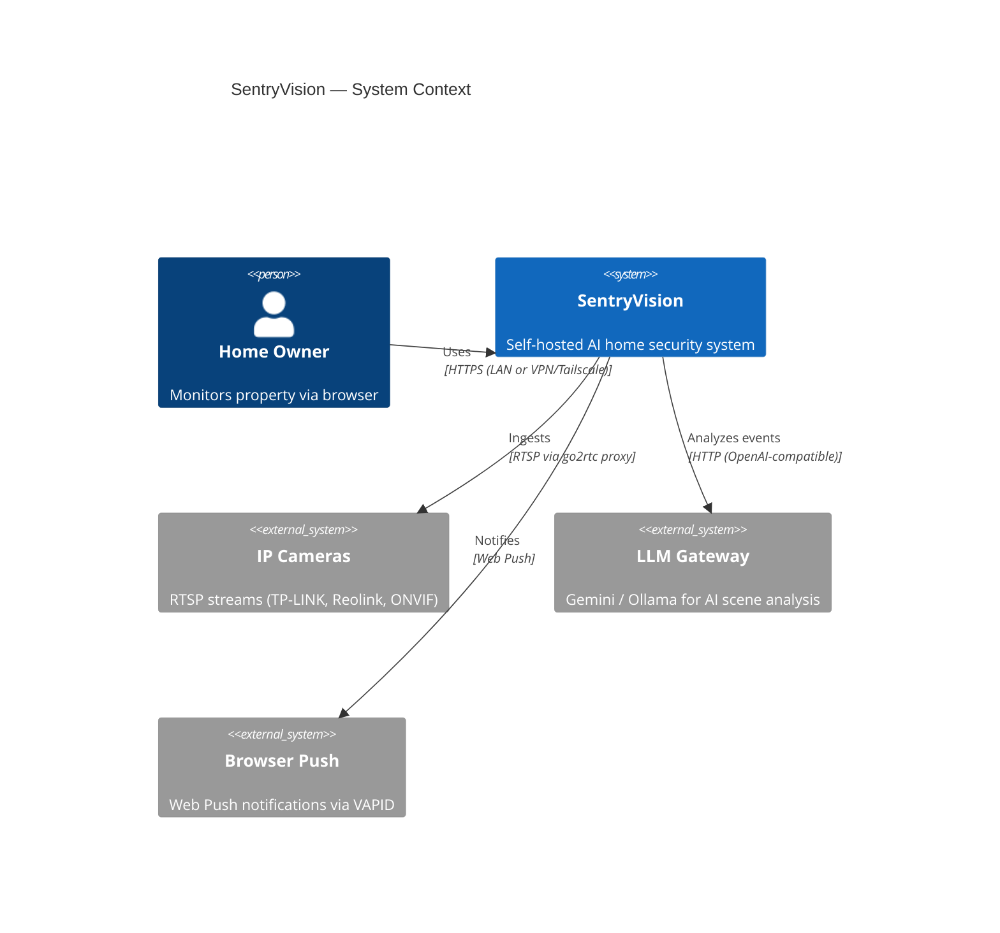
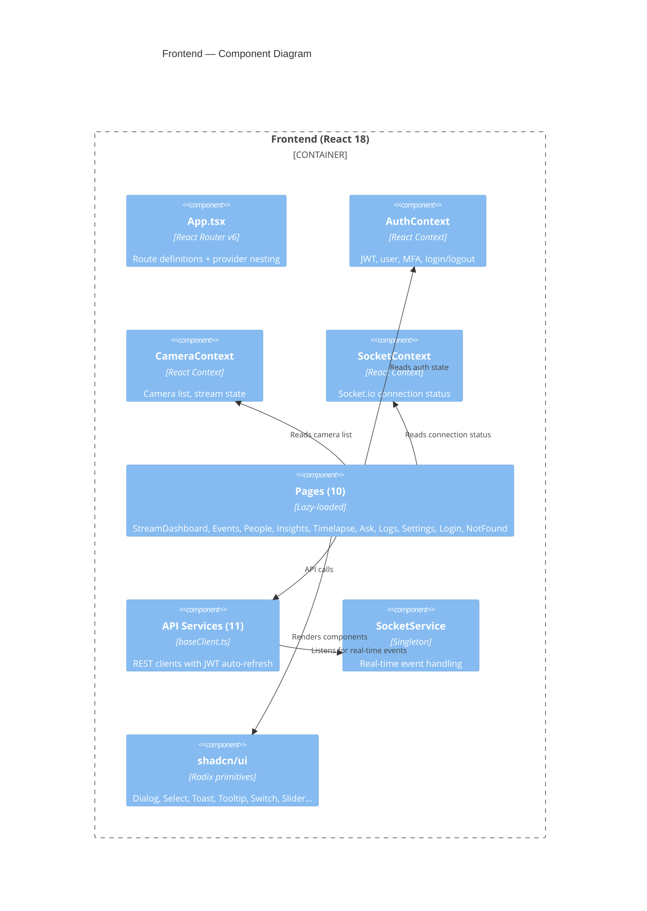
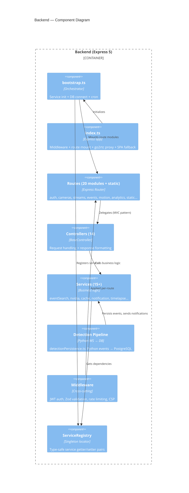

# SentryVision Architecture

**Version:** 1.7.0 · **Last updated:** 2026-09-24

Full system architecture with C4 diagrams, component boundaries, and data flow.

---

## C4 Level 1 — System Context



**External boundaries:** All traffic stays on the user's LAN or VPN. No cloud services are required for core operation. The LLM Gateway is optional; without it, events are stored without AI scene descriptions.

---

## C4 Level 2 — Container Diagram

```mermaid
C4Container
    title SentryVision — Container Diagram

    Person(user, "Home Owner", "Browser")

    Container(frontend, "Frontend", "React 18 + Vite + TailwindCSS", "SPA with 9 pages, served by backend")
    Container(backend, "Backend", "Express 5 + TypeScript + Socket.io", "REST API + real-time events")
    Container(opencv, "OpenCV Service", "Python Flask + YOLOv8n + InsightFace", "Real-time detection pipeline")
    Container(go2rtc, "go2rtc", "alexxit/go2rtc:1.9.14", "RTSP → WebRTC/MSE bridge")
    ContainerDb(postgres, "PostgreSQL", "15+ (26 migrations, TypeORM)", "Events, auth, detections, face embeddings")
    ContainerDb(cache, "In-Memory Cache", "Map (Redis optional)", "Session validity, rate limits")

    Rel(user, frontend, "Uses", "HTTPS")
    Rel(frontend, backend, "API calls + Socket.io", "REST :9753 + WS")
    Rel(backend, postgres, "Reads/Writes", "TypeORM / SQL")
    Rel(backend, cache, "Reads/Writes", "CacheService")
    Rel(backend, go2rtc, "Proxies", "HTTP + WebSocket upgrade")
    Rel(go2rtc, cameras, "Pulls RTSP", "RTSP")
    Rel(opencv, go2rtc, "Reads frames", "RTSP re-stream")
    Rel(opencv, backend, "Publishes events + frames", "WebSocket :9090")
    Rel(backend, opencv, "Settings + triggers", "HTTP :8084")
    Rel(backend, llm, "AI analysis", "HTTP")
    Rel(backend, push, "Push notifications", "Web Push (VAPID)")
```

### Container Details

| Container | Tech | Port | RAM Limit (Docker) | Key Design Decision |
|-----------|------|------|--------------------|---------------------|
| Frontend | React 18 / TS / Vite / TailwindCSS / Radix (shadcn/ui) | :5173 dev / :9753 prod (static) | — | Served by backend as static files, no separate container in production |
| Backend | Express 5 / TypeScript / TypeORM / Socket.io | :9753 (public) | 512M | One container serves both API + frontend; bound to 0.0.0.0 |
| OpenCV | Python Flask + MOG2 + YOLOv8n ONNX + InsightFace ArcFace | :8084 (HTTP, 127.0.0.1) / :9090 (WS, 127.0.0.1) | 2GB | Owns RTSP ingestion, motion gating, AI inference; not exposed publicly |
| go2rtc | alexxit/go2rtc:1.9.14 | :8555 (WebRTC, public) / :1984 (API, 127.0.0.1) | 128M | Holds sole RTSP connection per camera; management API bound to localhost |
| PostgreSQL | PostgreSQL 15+ | :5432 (127.0.0.1) | 512M | Tuned for low-memory (shared_buffers=48MB, max_connections=15) |
| Cache | In-memory Map | — | — | Redis optional (`REDIS_DISABLED=false`), disabled by default to save ~150MB RAM |

---

## C4 Level 3 — Frontend Components



### Frontend Data Flow

```
Browser
  ├─ React Router v6 → Route → Page (lazy-loaded)
  │    ├─ Zustand stores (future) ← client state
  │    ├─ React Query ← server state cache
  │    └─ API Services → baseClient.ts → fetchWithRetry (JWT + refresh)
  │         └─ /api/* → Vite proxy → Backend :9753
  └─ SocketService ← Socket.io → Backend :9753
       └─ streamFrame, cameraStatus, eventCreated, personDetected, faceDetected
```

### Frontend Routing

| Path | Page | Lazy | Auth |
|------|------|------|------|
| `/login` | Login.tsx | ✅ | Public |
| `/app/streams` | StreamDashboard.tsx | ✅ | Protected |
| `/app/events` | EventsPage.tsx | ✅ | Protected |
| `/app/people` | PeoplePage.tsx | ✅ | Protected |
| `/app/insights` | InsightsPage.tsx | ✅ | Protected |
| `/app/timelapse` | TimelapsePage.tsx | ✅ | Protected |
| `/app/ask` | AskPage.tsx | ✅ | Protected |
| `/app/logs` | LogsPage.tsx | ✅ | Protected |
| `/app/settings` | Settings.tsx | ✅ | Protected |
| `/` | Auth redirect | — | — |
| `*` | NotFound.tsx | ✅ | — |

### Provider Stack (Current)

```
ErrorBoundary
  → QueryClientProvider (React Query)
    → TooltipProvider
      → BrowserRouter
        → SocketProvider (Socket.io)
          → CameraProvider (camera state)
            → AuthProvider (JWT + MFA)
              → ScrollRevealProvider
                → Routes
```

---

## C4 Level 3 — Backend Components



### Backend Data Flow

```
Python OpenCV Service
  ├─ RTSP frames → go2rtc → FFmpeg → YOLO → Tracker → Publisher
  │
  ├─ WebSocket :9090 → Node.js PythonWsClient
  │    └─ detectionPersistence.ts
  │         ├─ PostgreSQL INSERT (events table)
  │         ├─ File save (JPEG snapshots)
  │         └─ Socket.io emit (eventCreated, personDetected, faceDetected)
  │
  └─ HTTP :8084 ← Backend triggers + settings
       ├─ Detection operations (person/face/motion settings)
       └─ Redo detection (re-process stored images)
```

### Route Mount Map

| Mount Path | File | Controller(s) | Endpoints |
|------------|------|---------------|-----------|
| `/api/auth` | `auth.ts` | AuthController | 10 |
| `/api/cameras` | `cameras.ts` | CameraController | 19 |
| `/api/streams` | `streams.ts` | StreamController | 4 |
| `/api/events` | `event-search.ts` + `events.ts` | EventController + eventSearchService | 12 |
| `/api/nvidia` | `nvidiaRoutes.ts` | NvidiaController | 11 |
| `/api/detection` | `detection-operations.ts` + `detectionRoutes.ts` | consolidatedDetectionService + detectionService | 12 |
| `/api/detection-redo` | `detectionRedoRoutes.ts` | (inline) | 2 |
| `/api/detection-data` | `detectionData.ts` | DetectionDataController | 2 |
| `/api/motion` | `motion.ts` | (inline) | 4 |
| `/api/analytics` | `analytics.ts` | AnalyticsController | 5 |
| `/api/highlights` | `highlights.ts` | (inline raw SQL) | 2 |
| `/api/timelapse` | `timelapse.ts` | TimelapseService (inline handlers) | 3 |
| `/api/face-clusters` | `face-clusters.ts` | (inline raw SQL) | 3 |
| `/api/chat` | `chat.ts` | ChatController | 3 |
| `/api/alerts` | `alerts.ts` | AlertController | 3 |
| `/api/notifications` | `notificationRoutes.ts` | NotificationService (inline handlers) | 10 |
| `/api/settings` | `settings.ts` | SettingsController | 2 |
| *(direct)* | `index.ts` | SystemController, StreamController, DetectionImageController | 15 |
| *(static)* | `staticRoutes.ts` | (inline + express.static) | 6 |

**Total: ~125 endpoints across 22 route files**

---

## Detection Pipeline (Python → Node.js)

```mermaid
C4Component
    title Detection Pipeline — Component Diagram

    Container_Boundary(py, "Python OpenCV Service") {
        Component(ffmpeg, "FFmpegReader", "FFmpeg subprocess", "BGR24 frames from RTSP @ 5 FPS, 640×360")
        Component(motion, "MotionGate", "OpenCV MOG2", "Background subtraction (pixel threshold 500)")
        Component(yolo, "InProcessYOLO", "YOLOv8n ONNX", "~215ms inference, class whitelist")
        Component(tracker, "ByteTracker", "Kalman filter", "Multi-object tracking lifecycle")
        Component(identity, "IdentityEnrichment", "InsightFace ArcFace", "Face recognition (30s cache)")
        Component(verifier, "HumanVerifier", "Tiered pipeline", "YOLO ≥ 0.90 → face → pose → floor 0.55")
        Component(publisher, "WebSocketPublisher", "ws client", "Frames + events → :9090")
    }

    Container_Boundary(node, "Node.js Backend") {
        Component(wsClient, "PythonWsClient", "ws server", "Receives from Python :9090")
        Component(persist, "detectionPersistence", "Event handler", "Persists to PostgreSQL + Socket.io emit")
    }

    Rel(ffmpeg, motion, "BGR24 frames")
    Rel(motion, yolo, "Motion-triggered frames")
    Rel(yolo, tracker, "Detections + bboxes")
    Rel(tracker, identity, "New tracks")
    Rel(identity, verifier, "Verified tracks")
    Rel(verifier, publisher, "Confirmed events")
    Rel(publisher, wsClient, "WebSocket :9090")
    Rel(wsClient, persist, "TrackingEvent")
    Rel(persist, postgres, "INSERT events")
```

### Pipeline Stages

| Stage | Component | Details |
|-------|-----------|---------|
| Frame capture | FFmpegReader | Reads RTSP via go2rtc, outputs BGR24 |
| Motion gating | MotionGate | MOG2 background subtraction, pixel threshold 500, 10-frame warmup |
| Object detection | InProcessYOLO | YOLOv8n ONNX, class whitelist, 215ms inference |
| Tracking | ByteTracker | Kalman filter, lifecycle: started/updated/ended |
| Face recognition | IdentityEnrichment | InsightFace ArcFace, 30s identity cache |
| Human verification | HumanVerifier | Tiered: YOLO ≥ 0.90 → face → MediaPipe pose → score floor |
| Publishing | WebSocketPublisher | JPEG frames + JSON events to Node.js :9090 |
| Persistence | detectionPersistence | PostgreSQL INSERT + Socket.io emit |
| AI enrichment | NvidiaController | Optional LLM scene analysis + threat assessment |

---

## Socket.io Events

| Event | Direction | Payload | Consumer |
|-------|-----------|---------|----------|
| `streamFrame` | Server → Client | `{ cameraId, frame }` | StreamPanel |
| `cameraStatus` | Server → Client | `{ cameraId, isActive, status }` | CameraContext |
| `eventCreated` | Server → Client | `{ id, cameraId, eventType, timestamp }` | EventsPage |
| `personDetected` | Server → Client | `{ cameraId, persons[], imagePath }` | StreamDashboard |
| `faceDetected` | Server → Client | `{ cameraId, faces[], imagePath }` | StreamDashboard |
| `enhancedMotionDetected` | Server → Client | `{ cameraId, hasPersons, hasFaces, analysis }` | StreamDashboard |
| `requestStream` | Client → Server | `{ cameraId, role }` | SocketService |
| `stopStream` | Client → Server | `{ cameraId, role }` | SocketService |

---

## Authentication & Security

```
Login Flow:
  POST /api/auth/login → JWT access token + refresh token
  POST /api/auth/mfa/challenge → TOTP verification (if MFA enabled)
  POST /api/auth/refresh → new access token

Request Flow:
  Authorization: Bearer <access_token>
  → authenticate() middleware
    → JWT verify (authService.verifyToken)
    → Session check (user_sessions table, cached 30s)
    → Role check (if roles specified)
  → Route handler
  → Controller → Service → Response

Rate Limits:
  Global: createApiRateLimit()
  Auth: createAuthRateLimit() — login/register
  MFA: createMfaRateLimit() — verify/challenge
  Detection: createDetectionRateLimit() — inference endpoints
```

---

## Middleware Stack

| Middleware | File | Purpose |
|------------|------|---------|
| `compression()` | express built-in | gzip responses |
| `cors()` | express middleware | CORS (dev: `*`, prod: explicit) |
| `express.json()` | express built-in | JSON body parsing |
| `helmet()` | helmet | CSP, HSTS, security headers |
| `authenticate()` | `middleware/auth.ts` | JWT + session verification |
| `optionalAuth` | `middleware/auth.ts` | JWT if present, no rejection |
| `requireUser` | `middleware/auth.ts` | Requires logged-in user |
| `requireAdmin` | `middleware/auth.ts` | Requires admin role |
| `validateBody(zodSchema)` | `middleware/zodValidation.ts` | Request body validation |
| `validateQuery(zodSchema)` | `middleware/zodValidation.ts` | Query param validation |
| `validateParams(zodSchema)` | `middleware/zodValidation.ts` | URL param validation |
| `createApiRateLimit()` | `middleware/enhancedRateLimit.ts` | Global rate limit |
| `createAuthRateLimit()` | `middleware/enhancedRateLimit.ts` | Login/register rate limit |

---

## Database Schema (Key Tables)

| Table | Purpose |
|-------|---------|
| `users` | User accounts (username, email, password hash, MFA secret, role) |
| `roles` | Hierarchical permissions (admin, user, viewer) |
| `user_sessions` | JWT sessions with device/IP tracking |
| `password_history` | Prevents password reuse |
| `audit_logs` | Tamper-detectable audit trail |
| `events` | Core detection events (UUID PK, timestamp, camera_id, event_type, confidence, image_path, persons_detected, faces_detected, object_detections JSONB, face_detections JSONB, analysis JSONB) |
| `face_embeddings` | Face vectors for InsightFace recognition |
| `visitor_timeline` | Face recognition visitor tracking |
| `notification_subscriptions` | Web Push subscriptions (VAPID) |
| `notification_preferences` | Per-user notification settings |
| `detection_configs` | Per-camera or global detection configuration |
| `batch_jobs` | Async detection processing queue |
| `system_settings` | Global system configuration |

---

## Deployment Topology

```
Docker Compose (4 services):
  sentryvision-postgres  :5432    PostgreSQL 15+ (512M limit)
  sentryvision-app       :9753    Express backend + static frontend (512M limit)
  sentryvision-opencv    :8084    Python detection pipeline (2GB limit)
  sentryvision-go2rtc    :8555    RTSP → WebRTC bridge (128M limit)
```

**Single-port deployment:** Only port 9753 is exposed publicly. All internal communication uses Docker network. The go2rtc admin port (1984) and OpenCV port (8084) are bound to `127.0.0.1` only.

---

## Future Architecture Directions

| Decision | Status | ADR |
|----------|--------|-----|
| Zustand for frontend client state | Proposed | ADR-001 |
| Frontend service decomposition | Proposed | ADR-002 |
| Backend MVC enforcement | Proposed | ADR-003 |

---

*For complete API endpoint mapping, see `API-SOURCE-OF-TRUTH.md`.*  
*For environment variable reference, see `ENVIRONMENT.md`.*  
*For interactive architecture diagram, open `.planning/graphs/SentryVision-Architecture.html`.*
