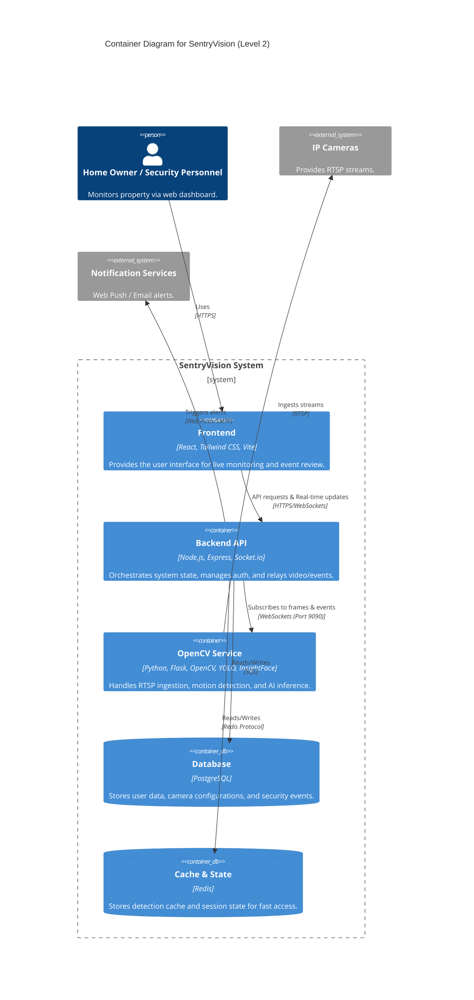

# SentryVision Architecture Overview

SentryVision is an AI-powered home security system designed for real-time monitoring and threat detection across multiple IP cameras. It employs a distributed architecture that separates concerns between user orchestration and intensive computer vision processing.

## 1. System Architecture (C4 Level 2)

## 2. Key Design Decisions (ADRs)

- **Dual-Pipeline Architecture (ADR-001):** Separation of standard API tasks (Node.js) from CV tasks (Python) to maximize performance and isolation.
- **Binary Frame Delivery (ADR-002):** Using raw binary payloads over WebSockets (JPEG bytes) to reduce bandwidth by 33% compared to Base64 encoding.
- **Adaptive FPS Throttling (ADR-006):** Dynamically adjusting frame rates based on the number of active viewers to optimize server resources and bandwidth.
- **Motion-Gated Detection (ADR-005):** AI inference is only triggered when significant motion is detected, drastically reducing CPU/GPU idle load.

## 3. Data Flow: Live Streaming Pipeline

1.  **Ingestion:** `opencv-service` uses `FFmpegReader` (Python subprocess) to pull raw BGR24 frames from IP Cameras via RTSP.
2.  **Processing:** Frames are passed through a `MotionGate`. If motion is detected, they may be sent for YOLO object detection or Face Recognition.
3.  **Transport (Inter-service):** Processed JPEG frames are sent from `opencv-service` to the `backend` via a raw WebSocket connection (binary mode).
4.  **Orchestration:** The `backend` (Node.js) updates its local frame buffer and broadcasts the frame to the specific Socket.io room for that camera.
5.  **Delivery:** The `frontend` (React) receives the binary frame, creates a Blob URL, and renders it in an `` tag with automatic URL revocation for memory efficiency.

## 4. Technology Stack

| Layer | Technology |
|---|---|
| **Frontend** | React, TypeScript, Tailwind CSS, TanStack Query, Socket.io-client |
| **Backend** | Node.js, Express, TypeORM, Socket.io, IORedis |
| **CV Microservice** | Python, OpenCV, NumPy, YOLOv8 (ONNX), InsightFace, asyncio |
| **Persistence** | PostgreSQL, Redis |
| **Infrastructure** | Docker, Nginx, FFmpeg |

## 5. Strategic Recommendations

- **GPU Offloading:** Ensure YOLO and InsightFace models are running on TensorRT or CUDA targets for high-density camera support.
- **Service Mesh / Internal Security:** For multi-host deployments, secure the internal inter-service WebSocket with TLS.
- **Horizontal Scaling:** The architecture is ready for horizontal scaling of the `opencv-service` behind a load balancer, with cameras distributed across multiple processing nodes.
- **Storage Management:** Implement an automated retention policy for archived snapshots and security events to manage disk usage over time.
