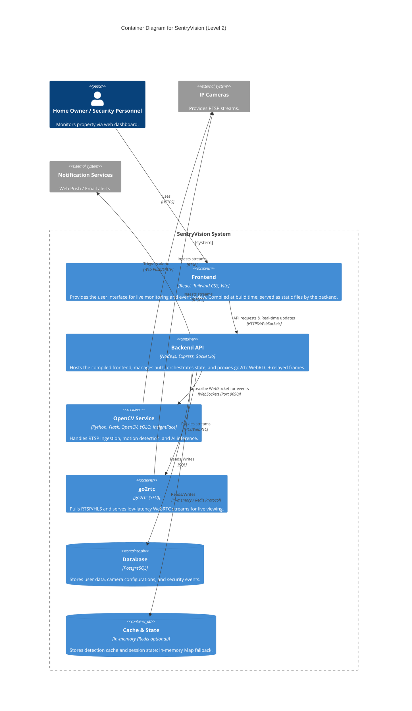

# SentryVision Architecture Overview

SentryVision is an AI-powered home security system designed for real-time monitoring and threat detection across multiple IP cameras. It employs a distributed architecture that separates concerns between user orchestration and intensive computer vision processing.

## 1. System Architecture (C4 Level 2)

```mermaid
C4Container
    title Container Diagram for SentryVision (Level 2)

    Person(owner, "Home Owner / Security Personnel", "Monitors property via web dashboard.")

    Boundary(sentry_system, "SentryVision System") {
        Container(frontend, "Frontend", "React, Tailwind CSS, Vite", "Provides the user interface for live monitoring and event review. Compiled at build time; served as static files by the backend.")
        Container(backend, "Backend API", "Node.js, Express, Socket.io", "Hosts the compiled frontend, manages auth, orchestrates state, and proxies go2rtc WebRTC + relayed frames.")
        Container(opencv_svc, "OpenCV Service", "Python, Flask, OpenCV, YOLO, InsightFace", "Handles RTSP ingestion, motion detection, and AI inference.")
        Container(webrtc, "go2rtc", "go2rtc (SFU)", "Pulls RTSP/HLS and serves low-latency WebRTC streams for live viewing.")
        ContainerDb(database, "Database", "PostgreSQL", "Stores user data, camera configurations, and security events.")
        ContainerDb(cache, "Cache & State", "In-memory (Redis optional)", "Stores detection cache and session state; in-memory Map fallback.")
    }

    System_Ext(cameras, "IP Cameras", "Provides RTSP streams.")
    System_Ext(notifications, "Notification Services", "Web Push / Email alerts.")

    Rel(owner, frontend, "Uses", "HTTPS")
    Rel(frontend, backend, "API requests & Real-time updates", "HTTPS/WebSockets")
    Rel(backend, database, "Reads/Writes", "SQL")
    Rel(backend, cache, "Reads/Writes", "In-memory / Redis Protocol")
    Rel(backend, webrtc, "Proxies streams", "HLS/WebRTC")
    Rel(backend, opencv_svc, "Subscribe WebSocket for events", "WebSockets (Port 9090)")
    Rel(opencv_svc, cameras, "Ingests streams", "RTSP")
    Rel(webrtc, cameras, "Ingests streams", "RTSPS")
    Rel(backend, notifications, "Triggers alerts", "Web Push/SMTP")
```

## 2. Key Design Decisions (ADRs)

- **Dual-Pipeline Architecture (ADR-001):** Separation of standard API tasks (Node.js) from CV tasks (Python) to maximize performance and isolation.
- **Motion-Gated Detection (ADR-005):** AI inference is only triggered when significant motion is detected, drastically reducing CPU/GPU idle load.
- **Persistent Camera Settings (ADR-007):** Per-camera settings and alerts persisted to PostgreSQL (`camera_settings`, `alerts` tables) instead of in-memory Maps.
- **WebRTC Media Pipeline (ADR-008):** Live video delivered over WebRTC via go2rtc instead of the legacy JPEG-over-Socket.io slideshow.
- **Low-Resource Optimizations (v1.6.0):** Frontend served as static files by the backend (no separate container); Redis replaced by in-memory cache (`REDIS_DISABLED`), saving ~150MB RAM on 2GB-hardware targets.

## 3. Data Flow: Live Streaming Pipeline

1.  **Ingestion:** `opencv-service` uses `FFmpegReader` (Python subprocess) to pull raw BGR24 frames from IP Cameras via RTSP for detection; `go2rtc` independently ingests the same sources for live viewing.
2.  **Processing:** Frames are passed through a `MotionGate`. If motion is detected, they may be sent for YOLO object detection or Face Recognition.
3.  **Transport (Inter-service):** Detection event frames are sent from `opencv-service` to the `backend` via a raw WebSocket connection (binary mode); tracking JSON is sent alongside.
4.  **Live viewing (WebRTC):** The `frontend` opens a `RTCPeerConnection` against `/go2rtc` (proxied by the backend to `go2rtc:1984`), and `CameraStream.tsx` renders the received track into a `<video>` element.
5.  **Detection events:** The `backend` persists tracking events to PostgreSQL and relays captures to the frontend over Socket.io for the Events UI.

## 4. Technology Stack

| Layer | Technology |
|---|---|
| **Frontend** | React 18, TypeScript, Tailwind CSS, Radix/shadcn, recharts, Socket.io-client (TanStack Query present but currently unused) |
| **Backend** | Node.js, Express, TypeORM, Socket.io, http-proxy-middleware (Redis optional via IORedis; in-memory cache default) |
| **CV Microservice** | Python, OpenCV, NumPy, YOLOv8 (ONNX), InsightFace, asyncio |
| **Live Media** | go2rtc (SFU) on port 1984 |
| **Persistence** | PostgreSQL 15+ (in-memory cache fallback) |
| **Infrastructure** | Docker Compose, FFmpeg |

## 5. Strategic Recommendations

- **GPU Offloading:** Ensure YOLO and InsightFace models are running on TensorRT or CUDA targets for high-density camera support.
- **Service Mesh / Internal Security:** For multi-host deployments, secure the internal inter-service WebSocket with TLS.
- **Horizontal Scaling:** The architecture is ready for horizontal scaling of the `opencv-service` behind a load balancer, with cameras distributed across multiple processing nodes.
- **Storage Management:** Implement an automated retention policy for archived snapshots and security events to manage disk usage over time.
