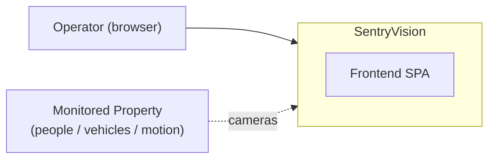

# SentryVision Frontend — Robustness Audit

> **Author:** Senior Solution Architect
> **Scope:** `frontend/` React 18 + TypeScript SPA (Vite)
> **Status:** Discovery + Modeling + ADRs + Action Plan complete. Mitigation in progress.
> **Version:** audited at `fff95be` (main)

---

## Phase 1 — Discovery & Current State Analysis

### Baseline gate status

| Gate | Result |
|------|--------|
| `tsc --noEmit` | **FAIL — 2 errors** on `main` |
| `eslint .` | PASS |
| `vite build` | PASS |
| Bundle size | largest chunk `ui-*.js` 259 KB (82 KB gzip) |

### Stack discovered

- **Runtime:** React 18.3, React Router 6, React Query 5, Radix UI / shadcn (40 primitives), Tailwind 3, recharts, framer-motion, socket.io-client, zod, react-hook-form.
- **Build:** Vite 5, SWC, `tsc` typecheck, ESLint 9, Jest 30.
- **Frontend routing tree** (`App.tsx`): `/login`, `/app/streams`, `/app/events`, `/app/settings`, `/app/timelapse` (+ `*` NotFound). Every protected route is individually wrapped in `ErrorBoundary`.

### Module inventory

| Area | Files | Notes |
|------|-------|-------|
| API layer | `services/api/*` (baseClient + 9 modules) | unified `fetchWithRetry` |
| State | `contexts/AuthContext`, `SocketContext`, `CameraContext` | reducer + refs |
| Pages | `EventsPage` (950 L), `Settings` (978 L), `StreamDashboard`, `TimelapsePage`, `Login`, `NotFound` | |
| Live UI | `AdaptiveCameraGrid`, `StreamPanel`, `QualitySection`, `RecentDetectionsSection` | |
| Events UI | `EventDetailPanel` (652 L), `EventTimeline`, `SmartFilters`, `RelatedEvents` | |
| Guards | `ErrorBoundary` (per-route), `ProtectedRoute` | |

### Raw gate output (baseline)

```
src/pages/EventsPage.tsx(158,27): error TS2339:
  Property 'sceneContext' does not exist on type '{ summary: string; persons: unknown[]; ... }'
src/pages/EventsPage.tsx(345,29): error TS2339:
  Property 'sceneContext' does not exist on type '{ sceneDescription?: string; threatAssessment?: ... }'
```

---

## Phase 2 — Architecture (C4 Modeling)

### Level 1 — System Context



### Level 2 — Container

```mermaid
flowchart LR
    subgraph Frontend["Frontend Container — React 18 SPA (Vite)"]
        Auth["AuthContext — token lifecycle"]
        Views["Pages / Events / Settings / Streams"]
        UI["ui (40 Radix primitives) + recharts"]
        Data["Server layer: baseClient + 9 API modules"]
    end
    subgraph Backend["Backend — Express 5"]
        REST["REST /api/*"]
        SocketIO["Socket.io"]
    end
    subgraph DBstore["Database — PostgreSQL"]
        EVT["events / users / ..."]
    end
    subgraph CV["OpenCV — Python"]
        PIPE["Detection pipeline"]
    end
    Operator["Browser"] --> UI
    UI --> Views
    UI --> Auth
    Views --> Data
    Views --> UI
    Data --> REST
    Data --> SocketIO
    REST --> EVT
    CV --> EVT

**Bottlenecks identified (Level 2):**
1. `@tanstack/react-query` is declared + mounted in `<QueryClientProvider>` but **not used anywhere** — dead weight + hand-rolled `useEffect`+`useState` fetching everywhere.
2. Token refresh logic is duplicated across `AuthContext.tsx` and `baseClient.ts` (two sources of truth → split-brain race).
3. `ui` barrel chunk (`recharts` + 40 Radix primitives) is the largest bundle — eagerly loaded.

---

## Phase 3 — Decision Governance (ADRs)

### ADR-001: Single-source token refresh

- **Context:** Refresh implemented in both `AuthContext.tsx` (`isRefreshingRef` guarded) and `baseClient.ts` (unguarded). Two parallel 401s → duplicate refresh POSTs + divergent token state.
- **Options:**
  1. Add a guard to `baseClient` (minimal; matches AuthContext).
  2. Rely on AuthContext's proactive timer only; remove baseClient 401→refresh.
  3. **Shared `getFreshToken()` module consumed by both.**
- **Decision:** Option 3 — one refresh owner, one guard; `baseClient` and `AuthContext` both call it. Decoupling > speed.
- **Consequences:** (+) no duplicate refresh, no split-brain; (−) small refactor touching two files.
- **Risk:** low.

### ADR-002 — Adopt react-query (or drop it)

- **Context:** `react-query` is mounted but unused; all data fetching is hand-managed (no cache dedupe, no abort-on-unmount, no stale-while-revalidate).
- **Options:**
  1. **Adopt react-query for data fetching** (cache dedup, stale, abort, retry).
  2. Remove the dead dependency + provider.
- **Decision:** Adopt incrementally, starting with the two hot views (`EventsPage` list, `StreamDashboard`). This is the robustness win the audit found missing.
- **Consequences:** (+) consistent caching, auto-abort on unmount, standardized retry; (−) refactor surface; some components keep local state.
- **Risk:** moderate.

---

## Phase 4 — Prioritized Action Plan

| # | Priority | Area | Change | Effort |
|---|----------|------|--------|--------|
| 1 | **BLOCKER** | Types | Add `sceneContext` to `analyzeEvent()` return type + `ApiEvent.analysis` in `EventsPage.tsx` | ~10 lines |
| 2 | High | `baseClient.ts` | Add `isRefreshing` guard + shared `getFreshToken()` (ADR-001) — fix duplicate concurrent refresh | ~15 lines |
| 3 | High | `SocketService.ts` | Clear stale `setTimeout` reject; guard against post-unmount setState | ~20 lines |
| 4 | Medium | `SocketService.ts` | `requestStream` queues request when disconnected and flushes on reconnect (currently silently drops) | ~15 lines |
| 5 | Medium | `App.tsx` | Configure `QueryClient` (retry/stale) + adopt react-query in `EventsPage` fetch (ADR-002) | ~40 lines |
| 6 | Low | Bundle | Code-split the `ui` barrel / lazy-load heavy primitives so recharts+Radix aren't all in the initial `ui` chunk | tooling |

**Overall health:** architecture is sound — per-route `ErrorBoundary`, guarded auth refresh, socket reconnect with backoff, clean API layer. The build-blocker (#1) and the refresh race (#2) are the only production-impacting defects.

---

## Appendix — Key Source References

- `frontend/src/services/api/baseClient.ts` — fetch, retry, 401→refresh (`attemptTokenRefresh`), the concurrency gap.
- `frontend/src/contexts/AuthContext.tsx` — reducer, token timer, `isRefreshingRef` guard.
- `frontend/src/services/SocketService.ts` — `SocketService` state machine.
- `frontend/src/App.tsx` — routing tree, `QueryClientProvider`, per-route ErrorBoundary.
- `frontend/src/pages/EventsPage.tsx` — monolith (searching/local nav + data streaming + AI button JSX duplication).
- `frontend/src/services/api/detectionService.ts` — `analyzeEvent()` / `analyzeEventWithBboxes()` contracts.

_Generated by the Senior Solution Architect workflow (System Archeology → C4 → ADRs → Recommendations)._